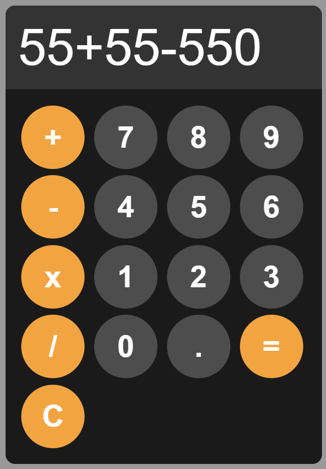

# Calculator App

A simple web-based calculator application.

## Description

This project is a basic calculator application built using HTML, CSS, and JavaScript. It allows users to perform basic arithmetic operations such as addition, subtraction, multiplication, and division.

## Features

- Addition, subtraction, multiplication, and division operations
- Clear button to reset the display
- Error handling for invalid expressions

## Usage

To use the calculator, simply open the HTML file in a web browser. The calculator provides a set of buttons for each digit (0-9), decimal point, and operators (+, -, *, /).

## Acknowledgements

I built this project as a quick practise, by watching BroCode on Youtube.
